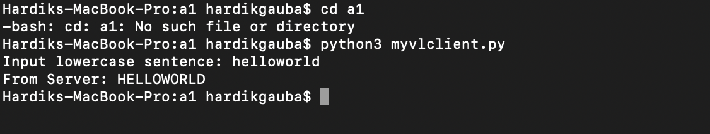

# CS158A Assignment 1: Variable-Length TCP Client/Server

## 📌 Description

This project implements a TCP client-server system that exchanges variable-length messages. Each message includes a 2-byte prefix indicating the number of characters in the message.

- The client sends a message prefixed with its 2-digit length (e.g., `10helloworld`).
- The server reads the length, processes that many bytes, converts the message to **uppercase**, and returns it.
- The server stays running, and the client exits after receiving the response.

---
### 💻 Example Server Output


### 📲 Example Client Output


## 🛠 How to Run

### 🖥 Terminal 1: Start the Server

```bash
cd a1
python3 myvlserver.py

Server will response
Server listening on localhost:12345

for Client it will be something like this in terminal
Input lowercase sentence: 10helloworld
From Server: HELLOWORLD

after running the client file Server will response with
Server listening on localhost:12345
Connected from ('127.0.0.1', 55555)
msg_len: 10
processed: 10helloworld
msg_len_sent: 10
Connection closed

